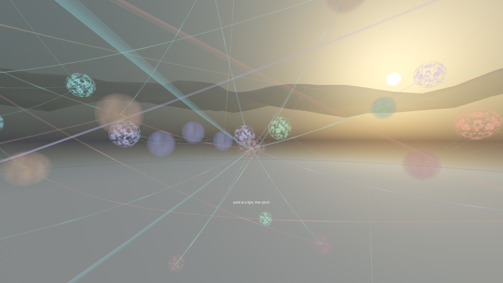
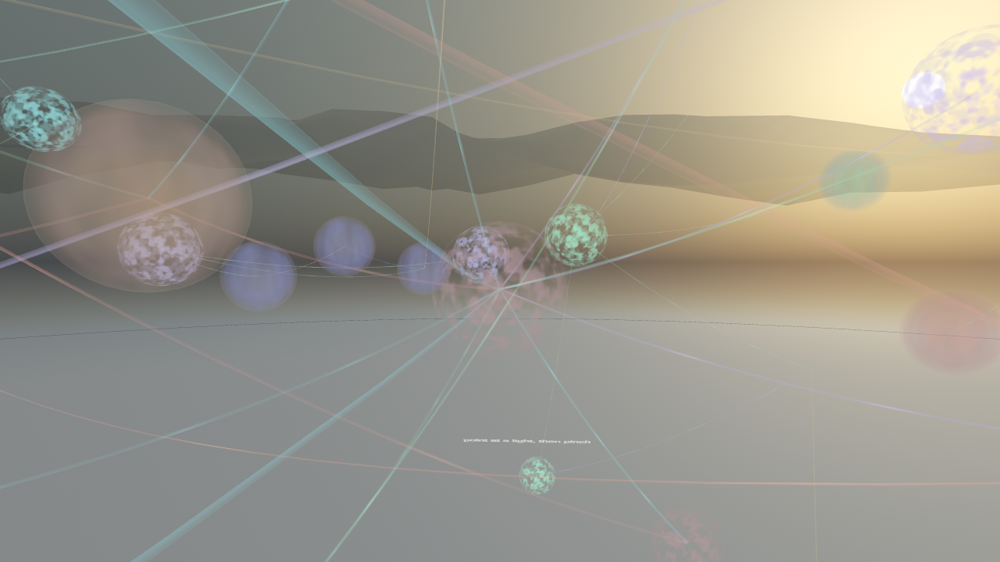
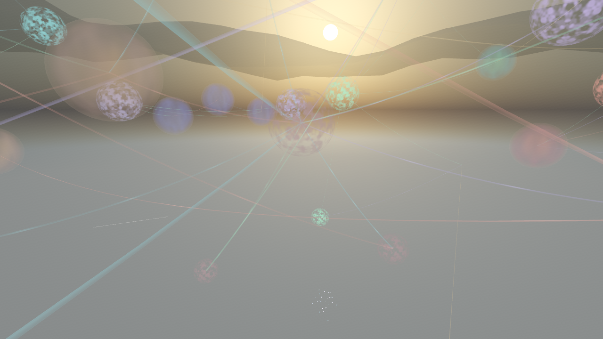
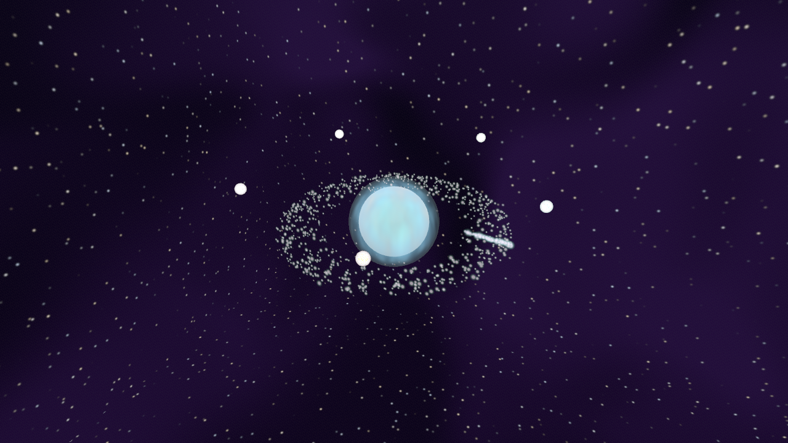
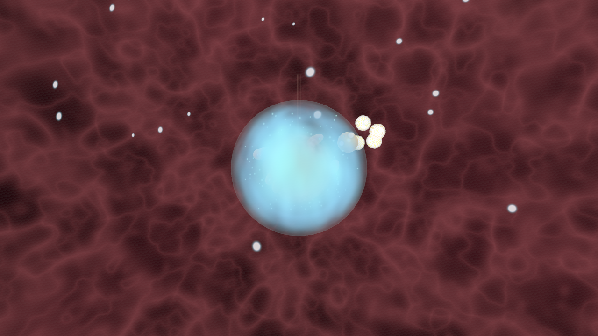
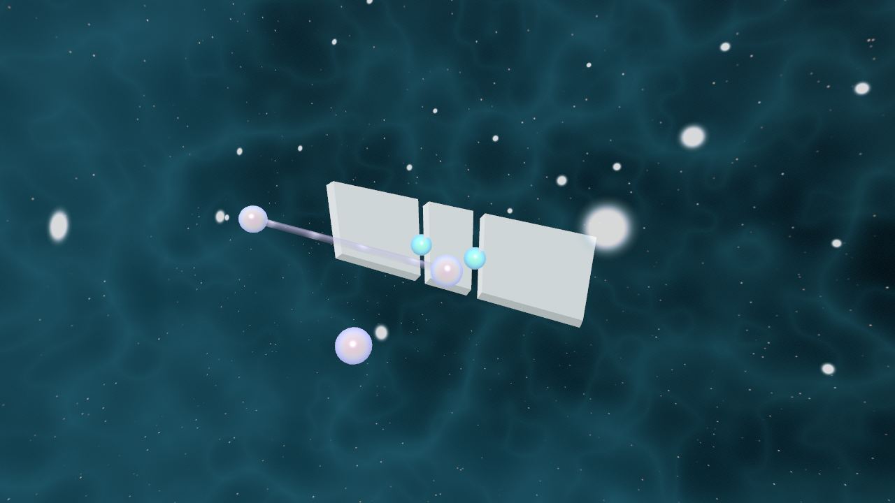
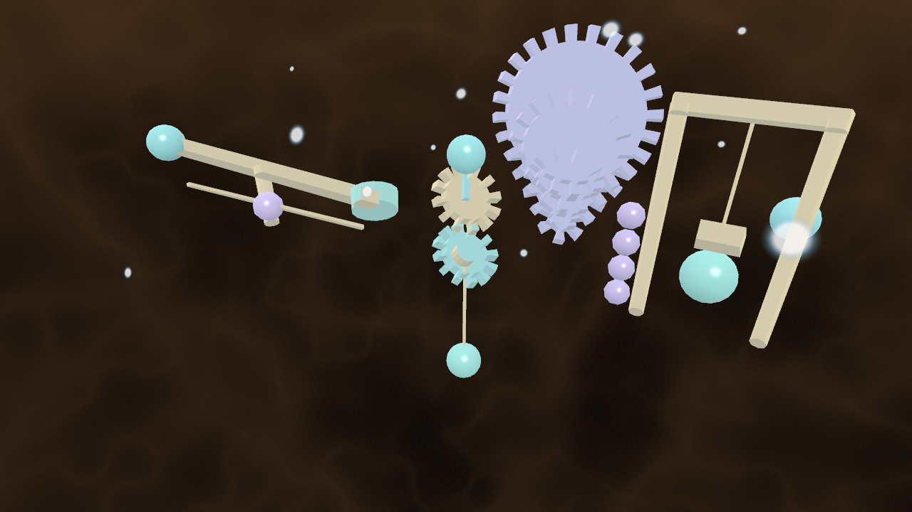
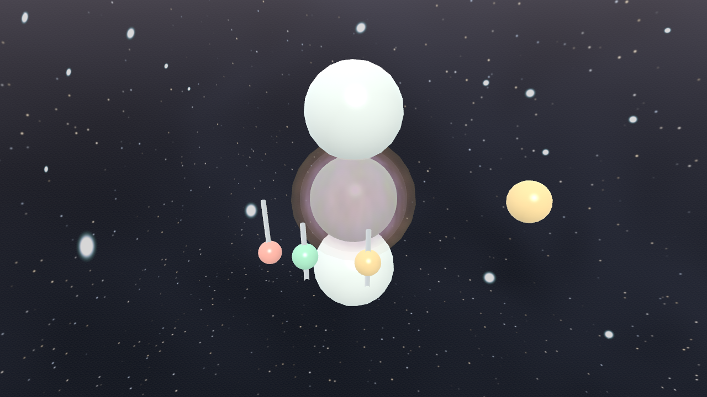
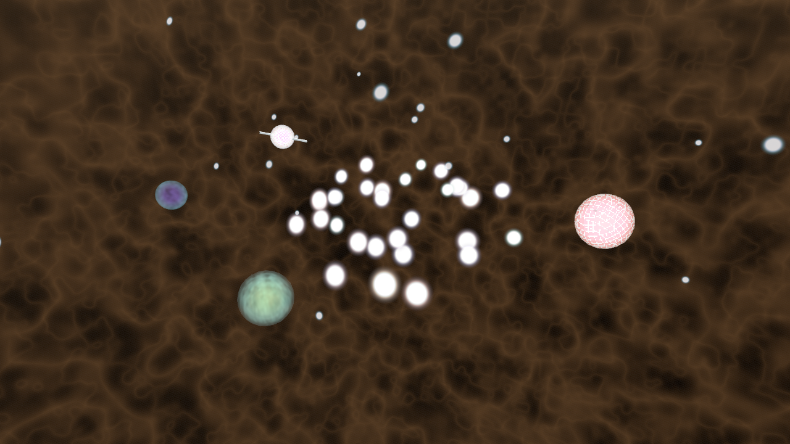
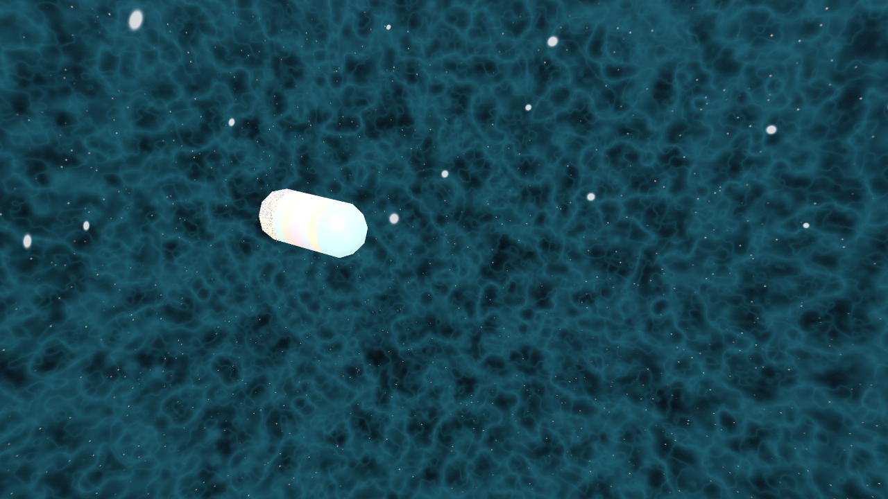

<h1 align="center">PRISM</h1>
<p align="center"><em>Nothing imported. Every mesh born in code.</em></p>
<p align="center">   </p>

<p align="center">
  
</p>

A mixed-reality piece built without a single imported asset — every mesh, material and motion is generated at runtime.

Built and shipped through the [ClaudeAI-UnityMCP-APK pipeline](https://github.com/ajinkyagorad/ClaudeAI-UnityMCP-APK-pipeline) — a headless Unity build server driven by Claude Code, serving APKs straight to the headset.

## Scenes

|   |   |
|:--:|:--:|
| <br><sub>Constellation</sub> | <br><sub>Constellation wide</sub> |
| <br><sub>Orbital</sub> | <br><sub>Living cell</sub> |
| <br><sub>Quantum garden</sub> | <br><sub>Machine cathedral</sub> |
| <br><sub>Planet guardian</sub> | <br><sub>Evolution engine</sub> |
| <br><sub>Algorithm city</sub> |   |

## What is here

| | |
|---|---|
| Unity | `6000.5.5f1` |
| Product | PRISM |
| Package | `com.triton.prism` |
| Scenes | Prism |

## AI

Written with Claude Code, which suits a procedural project: the whole artefact is source, so there is nothing to hand-place.

## Notes

- No textures, no models, nothing downloaded — by design. If you are adding an imported asset, you are in the wrong repository.

## Build

```bash
# open once so Unity restores Packages/ and regenerates Library/
Unity -projectPath .

# or headless, for Quest
Unity -batchmode -projectPath . \
      -executeMethod ServerBuild.BuildAndroid -logFile build.log
```

Needs **Unity 6000.5.5f1** with the Android module. The first open takes a few minutes while `Library/` is rebuilt from what is committed here.

**Do not build with `-nographics`** — the APK comes out black instead of passthrough and the build still reports success.

## Assets

This repository is **source only**. Model weights, volumes, imagery and package samples are left out and listed in [ASSETS.md](ASSETS.md), with the command that fetches each one back.

## Related

- [AI-XR](https://github.com/ajinkyagorad/AI-XR) — passthrough · on-device inference
- [CosmoSynth](https://github.com/ajinkyagorad/CosmoSynth) — simulation · checked against NASA
- [MRI Holo Viewer](https://github.com/ajinkyagorad/MRI-Holo-Viewer) — passthrough · medical imaging
- [PlanetGolf](https://github.com/ajinkyagorad/PlanetGolf) — mixed reality · orbital mechanics
- [Planetary Vitals](https://github.com/ajinkyagorad/PlanetaryVitals) — mixed reality · real measurements
- [Holo Idea Tests](https://github.com/ajinkyagorad/holo-idea-tests) — mixed reality · 26 sketches
- [ToolBench XR](https://github.com/ajinkyagorad/toolbench-xr) — mixed reality · tool bench

---

<sub>Captures are real renders from the headset build, composited onto passthrough black so they read the same in GitHub's light and dark themes. `Library/`, `Temp/`, `obj/` and build output are regenerated and not committed.</sub>
